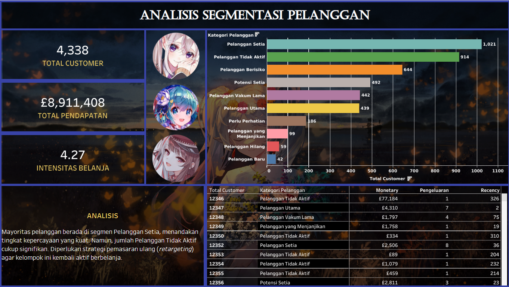

# ecommerce-rfm-analysis

## Apa itu ecommerce-rfm-analysis

Ecommerce RFM Analysis merupakan proyek analisis data yang saya rancang untuk mengelompokkan pelanggan ritel daring berdasarkan perilaku transaksi historis mereka. Proyek ini menerapkan metode segmentasi RFM (Recency, Frequency, Monetary) agar pelaku bisnis dapat memahami karakteristik pelanggan secara mendalam dan mengambil keputusan berbasis data.

---

## Tujuan Pengembangan

Proyek ini dikembangkan guna membantu identifikasi pelanggan yang paling bernilai bagi bisnis serta mendeteksi pelanggan yang berisiko berhenti berlangganan (churn). Solusi ini dibuat untuk menjawab tantangan dalam menentukan strategi pemasaran yang tepat sasaran. Selain itu, tujuan saya mengembangkan proyek ini adalah sebagai sarana untuk mengasah kemampuan teknis dalam pengolahan data menggunakan Python, pembersihan data (data cleaning), serta visualisasi data interaktif menggunakan Tableau.

---

## Fitur Utama

Adapun komponen dan fitur utama dari proyek analisis ini adalah:

1. Pengolahan Data dan Kalkulasi RFM
   Menggunakan Python (Jupyter Notebook) untuk memproses dataset transaksi ritel, membersihkan data dari nilai yang tidak valid, dan menghitung skor Recency, Frequency, serta Monetary untuk setiap pelanggan.

2. Segmentasi Pelanggan
   Sistem mengelompokkan pelanggan ke dalam kategori spesifik seperti Pelanggan Setia, Pelanggan Utama, Pelanggan Berisiko, dan Pelanggan Tidak Aktif berdasarkan skor RFM mereka.

3. Dashboard Interaktif
   Fitur visualisasi utama menggunakan Tableau yang menampilkan metrik vital secara real-time, meliputi Total Pendapatan, Jumlah Pelanggan, dan Intensitas Belanja Rata-rata.

4. Analisis Strategis
   Dashboard dilengkapi dengan panel wawasan (insight) yang memberikan rekomendasi strategi bisnis, seperti program retensi untuk pelanggan setia atau kampanye re-aktivasi untuk pelanggan yang sudah lama tidak bertransaksi.

5. Grafik Distribusi dan Proporsi
   Menampilkan sebaran pelanggan melalui grafik batang dan proporsi kontribusi pendapatan melalui visualisasi diagram donat untuk memudahkan pembacaan data sekilas.

---

## Motivasi Saya

Saya akan terus mengembangkan kemampuan analisis saya agar dapat mengubah data mentah menjadi wawasan bisnis yang dapat ditindaklanjuti, sehingga dapat memberikan dampak nyata bagi efisiensi strategi pemasaran sebuah perusahaan.

---

## Pesan dari Saya

Sebagai informasi, repositori ini mencakup kode sumber Python untuk pemrosesan data dan file Tableau Packaged Workbook (.twbx). Untuk melihat hasil visualisasi secara penuh tanpa perlu mengunduh file, Anda dapat mengakses tautan Tableau Public yang saya sertakan di bawah ini.

---

## Dokumentasi

Anda dapat mengakses dashboard interaktif secara langsung melalui tautan berikut:
[Tekan Disini](https://public.tableau.com/app/profile/gerald.sitorus/viz/rfm-analysis-dashboard/Dashboard1?publish=yes)

---

## Pengembang

Gerald Jepedro Sitorus
[@g3raldatsc](https://github.com/g3raldatsc)

---

  

